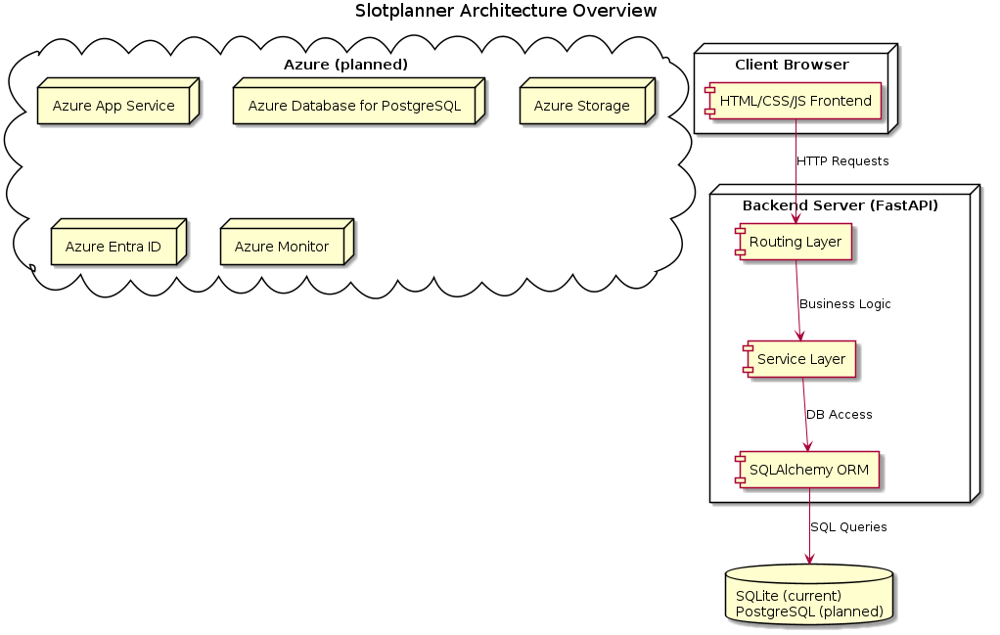
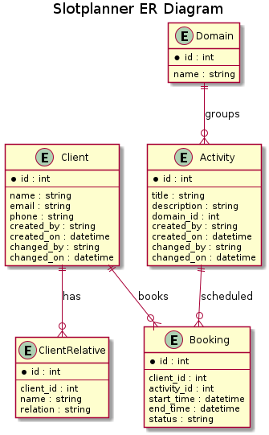
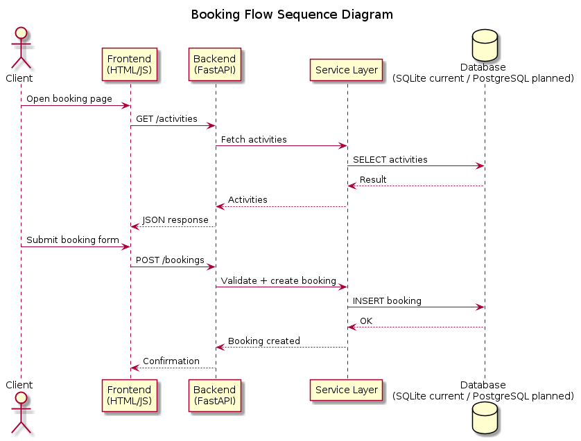

# Slotplanner – Architecture and System Overview

Slotplanner is a scheduling and resource‑management platform designed to handle bookings, activities, clients, and administrative workflows. This repository provides a public, high‑level overview of the system’s architecture, data model, API structure, and Azure deployment approach. Production code is not included.

## Architecture Overview

Slotplanner follows a modular, service‑oriented architecture:

- Backend: FastAPI
- ORM/Data Layer: SQLAlchemy
- Schemas and Validation: Pydantic
- Frontend: HTML, CSS, and JavaScript (React + TypeScript planned)
- Hosting: Azure App Service
Authentication: Session-based authentication (planned migration to Azure Entra ID)
- Storage: SQLite file-based database (planned migration to PostgreSQL)
- CI/CD: GitHub Actions

The system is organized into clear domains such as users, clients, relatives, activities, bookings, and administrative management.

## Data Model

The platform uses a relational schema with entities including:

- Clients
- Client relatives
- Activities
- Bookings
- Domains
- Administrative users
- Audit fields (created_by, changed_by, timestamps)

Diagrams in the `/docs/` directory illustrate relationships and workflows.


## Diagrams

### Architecture Diagram


### Entity Relationship Diagram


### Booking Flow Diagram



## API Design

The backend exposes a structured REST API with:

- Consistent request and response schemas
- Separation of routing, service logic, and validation
- Pydantic‑based input and output models
- Error handling and standardized responses
- Endpoints for booking operations and administrative management

Example endpoints and flows are documented in `/docs/api/`.


## Deployment

### Current Deployment
Slotplanner currently runs locally using:

- Uvicorn for backend execution
- Caddy for reverse proxy and static file serving
- SQLite as the local database
- Session-based authentication
- Local file-based storage for assets and data

### Planned Azure Deployment
A future cloud deployment is planned using Azure services:

- Azure App Service for backend and frontend hosting
- Azure Database for PostgreSQL as the primary database
- Azure Storage for static assets and backups
- Azure Monitor for logging and metrics
- Azure Entra ID for authentication and identity management
- Deployment slots for staging and production environments
- GitHub Actions for automated CI/CD pipelines

Documentation for the planned deployment will be added in `/docs/deployment/`.


## Screenshots and Diagrams

The `/screenshots/` and `/docs/` directories contain:

- User interface previews
- Architecture diagrams
- Sequence diagrams
- Booking workflow illustrations
- Administrative interface overview

These materials demonstrate the system without exposing internal implementation details.

## Purpose of This Repository

This repository is intended for technical reviewers, recruiters, and hiring managers. It highlights the architectural design, engineering decisions, and structure of the Slotplanner system while keeping the production code private.

## Repository Structure

```
slotplanner-showcase/
├── README.md
├── .gitignore
├── docs/
│   ├── architecture/
│   ├── data-model/
│   ├── flows/
│   ├── api/
│   └── deployment/
├── screenshots/
└── demo/
```
